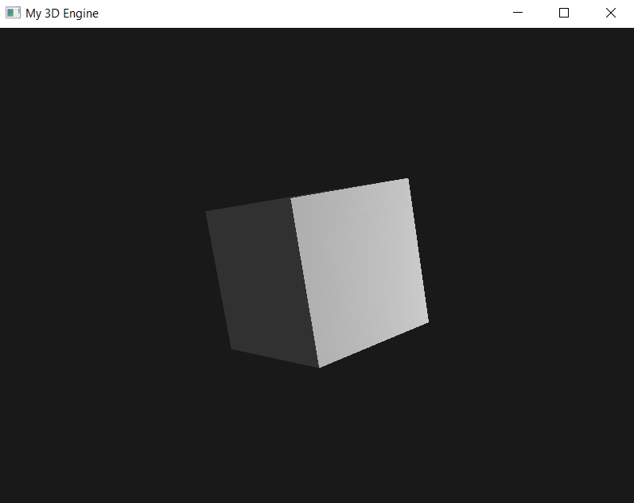
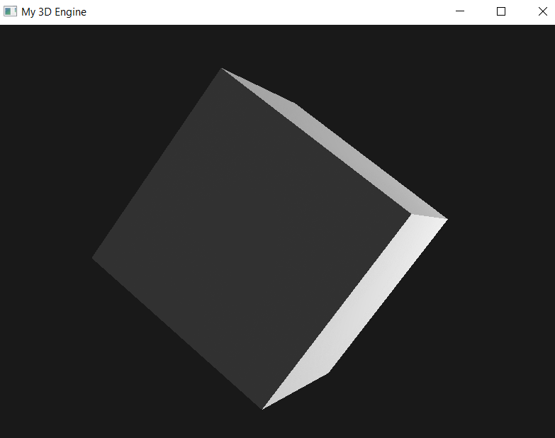
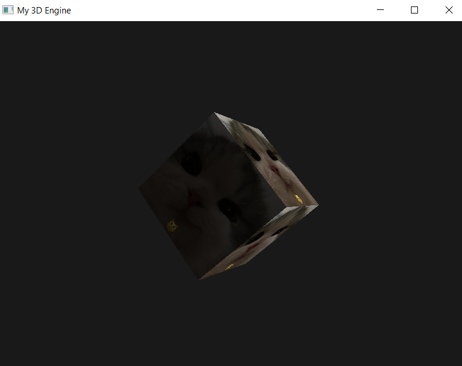
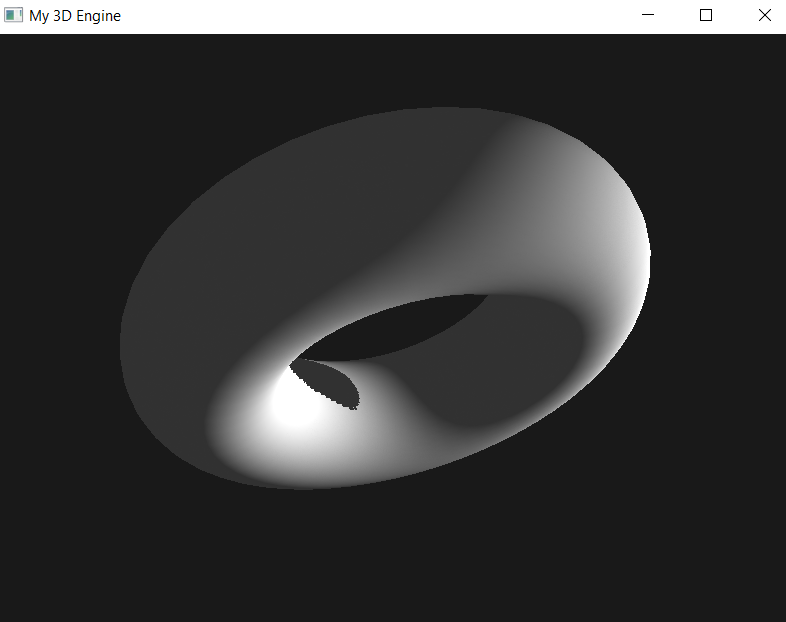
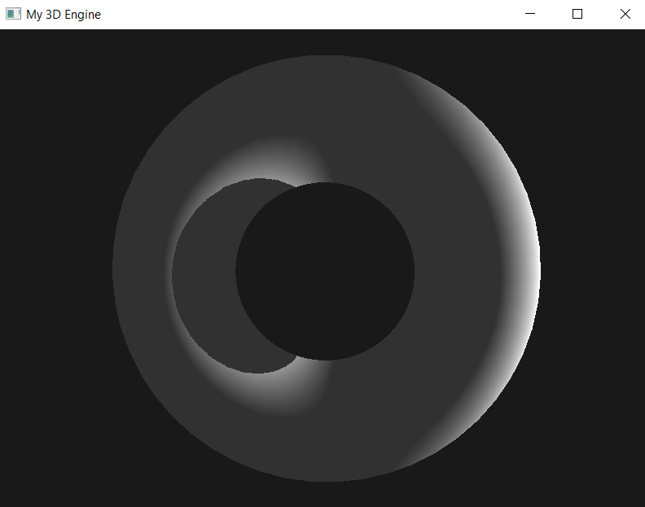

# Документация математического ядра (Custom 3D Engine Math)

Представляю мой движок, написанный с нуля на С++ с использованием библиотек OpenGL, GLFW, GLAD, но без использования библиотек, облегчающих всякого рода математику. В проекте есть полный контроль над тремя классами:

1)  **Matrix4** (матрица 4х4)
2)  **Vector** (вектор в пространстве)
3)  **Torus** (задание тора)

-----

## 1\. Класс Matrix4

| Функционал | Описание |
| :--- | :--- |
| **Хранение** | Матрица представлена массивом из 16 элементов, хранящимся в **строковом порядке (Row-Major)**. |
| **Конструкторы** | `Matrix4()`: Единичная матрица.<br>`Matrix4(float)`: Диагональная матрица с указанным значением. |
| **Доступ** | `float& at(int, int)`: Ссылка на элемент по строке/столбцу. |
| **Операции** | `Matrix4 operator*(const Matrix4 &) const;`: Перемножение матриц.<br>`Matrix4 trans();`: Транспонирование матрицы.<br>`float det();`: Детерминант (метод Гаусса).<br>`Matrix4 reversed();`: Обращение матрицы.<br>`Matrix4 normMatrix() const;`: Матрица нормалей $(\text{Model}^{-1})^T$. |
| **Преобразования** | `static Matrix4 translate/rotateX/Y/Z/scale(...)`: Создание матриц перемещения, вращения и масштабирования. |
| **Проекции** | `static Matrix4 Perspective(...)`: Матрица перспективной проекции.<br>`static Matrix4 lookAt(...)`: Матрица вида (View Matrix).<br>`static Matrix4 ortho(...)`: Матрица ортогональной проекции (используется для теней). |

## 2\. Класс Vector

| Функционал | Описание |
| :--- | :--- |
| **Хранение** | Координаты $x, y, z$. |
| **Конструкторы** | `Vector()`: (0,0,0).<br>`Vector(float,float,float)`: С указанными координатами. |
| **Геттеры/Сеттеры** | `getX/Y/Z()`, `setX/Y/Z()`. |
| **Длина** | `dist()`, `distBetweenDots()`. |
| **Операции** | `operator+/-(const Vector&)`: Сложение/разница векторов.<br>`float operator*(const Vector&)`: **Скалярное произведение (Dot Product)**.<br>`Vector operator*(float)`: Умножение на скаляр.<br>`Vector normalize() const`: Нормализация вектора.<br>`Vector crossprod(const Vector&)`: **Векторное произведение (Cross Product)**. |

-----

# Интеграция математики и рендеринг

Интеграция математики происходит в три этапа: создание матриц проекции/вида, создание модельной матрицы и передача данных в шейдеры.

## 1\. Инициализация матриц проекции/вида

На этом этапе задаются параметры "объектива" камеры и её положение в мире.

```cpp
// 1) Матрица проекции (Projection)
Matrix4 projection = Matrix4::Perspective(fovRad, aspect, 0.01f, 500.0f);

// 2) Матрица вида (View)
Matrix4 view = Matrix4::lookAt(camPos, target, up);
```

## 2\. Создание модельной матрицы

Формируется модельная матрица, которая переводит каждую координату из локальной системы отсчета в мировую.

```cpp
// Комбинирование (Model = Translate * RotateY * RotateX)
Matrix4 model = transMat * (rotYMat * rotXMat);

// Генерация матрицы нормалей для корректного освещения
Matrix4 normalMatrix = model.normMatrix();
```

## 3\. Использование матриц в шейдерах (GLSL)

### 3a. Преобразование вершин

Положение каждой вершины вычисляется в вершинном шейдере (Vertex Shader) с использованием конвейера преобразований:

$$GlPosition = \mathbf{Projection} \times \mathbf{View} \times \mathbf{Model} \times \text{Vector}(aPos, 1.0)$$

### 3b. Расчет теней (Shadow Map)

Для расчета теней сначала создается **карта глубины** (Depth Map), используя матрицу пространства света:

$$GlPosition_{shadow} = \mathbf{LightSpaceMatrix} \times \mathbf{Model} \times \text{Vector}(aPos, 1.0)$$

### 3c. Модель освещения (Фрагментный шейдер)

Используется модель **диффузного освещения Ламберта** (Lambertian Diffuse Lighting), где интенсивность света пропорциональна косинусу угла между нормалью и вектором света:

$$I_{diffuse} = L_{color} \times K_{diffuse} \times \max(0, \mathbf{N}_{norm} \cdot \mathbf{VL}_{norm})$$

Где $\mathbf{N}$ — вектор нормали (преобразованный через $\mathbf{NormalMatrix}$), а $\mathbf{VL}$ — вектор света.

-----






